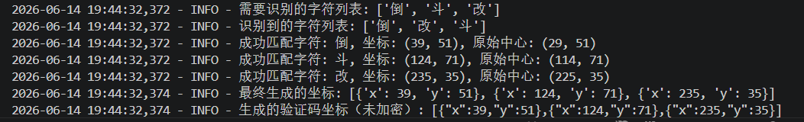

# 工学云自动签到 - GitHub Actions部署

这是一个基于GitHub Actions的工学云自动签到系统，支持多用户配置，可以自动执行上班卡和下班卡的签到操作。

## 效果展示
<p align="center">
  
  &nbsp;&nbsp;
  
</p>
<p align="center">
  <sub><b>签到成功</b>（左）&nbsp;&nbsp;&nbsp;&nbsp;&nbsp;&nbsp;&nbsp;&nbsp;&nbsp;&nbsp;&nbsp;&nbsp;&nbsp;&nbsp;&nbsp;&nbsp;&nbsp;&nbsp;&nbsp;&nbsp;<b>消息推送</b>（右）</sub>
</p>
## 功能特点

- ✅ 支持多用户配置
- ✅ 自动判断打卡类型（上班卡/下班卡）
- ✅ 定时执行（早上7点和下午5点）
- ✅ 手动触发执行
- ✅ 邮件通知功能
- ✅ 免服务器运行

## 本地测试快照功能
- **本地测试**：使用main.py进行测试
- **Before**：代码执行前的效果
- **After**：代码中ai模型推理执行后的效果
<p align="center">
  
</p>
<p>
  
  &nbsp;
  
</p>

## 部署步骤
https://github.com/kaka-niu/gongxueyun-action
### 1. Fork 本仓库

点击右上角的"Fork"按钮，将本仓库复制到你的GitHub账户下。

### 2. 配置GitHub 工作流无服务器部署

在你的Fork仓库中，进入`Settings` -> `Secrets and variables` -> `Actions`，添加Secret。
`详细教程地址`：https://github.com/Rockytkg/AutoMoGuDingCheckIn/wiki/Github-%E5%B7%A5%E4%BD%9C%E6%B5%81%E9%83%A8%E7%BD%B2

#### 用户配置参数说明

以下是用户配置中各参数的详细说明：

| 配置层级 | 参数名 | 类型 | 必填 | 默认值 | 说明 |
|---------|--------|------|------|--------|------|
| **user** | phone | string | 是 | - | 工学云登录手机号 |
| **user** | password | string | 是 | - | 工学云登录密码 |
| **clockIn** | mode | string | 是 | - | 打卡模式：`everyday`(每天)、`weekday`(工作日)、`customize`(自定义)、`twice_daily`(一天两次) |
| **clockIn.location** | address | string | 是 | - | 打卡地址（详细地址） |
| **clockIn.location** | latitude | string | 是 | - | 纬度坐标 |
| **clockIn.location** | longitude | string | 是 | - | 经度坐标 |
| **clockIn.location** | province | string | 是 | - | 省份 |
| **clockIn.location** | city | string | 是 | - | 城市 |
| **clockIn.location** | area | string | 是 | - | 区域 |
| **clockIn** | holidaysClockIn | boolean | 否 | false | 节假日是否打卡 |
| **clockIn** | customDays | array | 否 | [1,2,3,4,5] | 自定义打卡日期（1-7代表周一至周日） |
| **clockIn.time** | start | string | 是 | - | 上班打卡时间（格式：HH:MM） |
| **clockIn.time** | end | string | 是 | - | 下班打卡时间（格式：HH:MM） |
| **clockIn.time** | float | number | 否 | 1 | 时间浮动范围（分钟） |
| **smtp** | enable | boolean | 否 | false | 是否启用邮件通知 |
| **smtp** | host | string | 否 | - | SMTP服务器地址 |
| **smtp** | port | number | 否 | 465 | SMTP服务器端口 |
| **smtp** | username | string | 否 | - | 邮箱用户名 |
| **smtp** | password | string | 否 | - | 邮箱密码/SMTP授权码 |
| **smtp** | from | string | 否 | - | 发件人显示名称 |
| **smtp** | to | array | 否 | - | 收件人邮箱列表 |
| **device** | - | string | 否 | - | 设备信息字符串，用于模拟手机登录 |

#### 配置示例

**单用户配置：**
```json
[{
    "config": {
      "user": {
        "phone": "工学云手机号1",
        "password": "工学云密码1"
      },
      "clockIn": {
        "mode": "twice_daily",
        "location": {
          "address": "四川省 · 成都市 · 高新区 · 在科创十一街附近",
          "latitude": "30.559922",
          "longitude": "104.093023",
          "province": "四川省",
          "city": "成都市",
          "area": "高新区"
        },
        "holidaysClockIn": false,
        "customDays": [1, 2, 3, 4, 5],
        "time": { 
          "start": "7:00",
          "end": "17:00",
          "float": 1
        }
      },
      "smtp": {
        "enable": true,
        "host": "smtp.qq.com",
        "port": 465,
        "username": "your_email@qq.com",
        "password": "your_smtp_password",
        "from": "工学云签到通知",
        "to": ["your_email@qq.com"]
      },
      "device": "{brand: TA J20, systemVersion: 17, Platform: Android, isPhysicalDevice: true, incremental: K23V10A}"
    }}
]
```

**多用户配置：**
```json
[
  {
    "config": {
      "user": {
        "phone": "工学云手机号1",
        "password": "工学云密码1"
      },
      "clockIn": {
        "mode": "twice_daily",
        "location": {
          "address": "四川省 · 成都市 · 高新区 · 在科创十一街附近",
          "latitude": "30.559922",
          "longitude": "104.093023",
          "province": "四川省",
          "city": "成都市",
          "area": "高新区"
        },
        "holidaysClockIn": false,
        "customDays": [1, 2, 3, 4, 5],
        "time": { 
          "start": "7:00",
          "end": "17:00",
          "float": 1
        }
      },
      "smtp": {
        "enable": true,
        "host": "smtp.qq.com",
        "port": 465,
        "username": "your_email@qq.com",
        "password": "your_smtp_password",
        "from": "工学云签到通知",
        "to": ["your_email@qq.com"]
      },
      "device": "{brand: TA J20, systemVersion: 17, Platform: Android, isPhysicalDevice: true, incremental: K23V10A}"
    }
  },
  {
    "config": {
      "user": {
        "phone": "工学云手机号2",
        "password": "工学云密码2"
      },
      "clockIn": {
        "mode": "twice_daily",
        "location": {
          "address": "四川省 · 成都市 · 高新区 · 在科创十一街附近",
          "latitude": "30.559922",
          "longitude": "104.093023",
          "province": "四川省",
          "city": "成都市",
          "area": "高新区"
        },
        "holidaysClockIn": false,
        "customDays": [1, 2, 3, 4, 5],
        "time": { 
          "start": "7:00",
          "end": "17:00",
          "float": 1
        }
      },
      "smtp": {
        "enable": true,
        "host": "smtp.qq.com",
        "port": 465,
        "username": "your_email@qq.com",
        "password": "your_smtp_password",
        "from": "工学云签到通知",
        "to": ["your_email@qq.com"]
      },
      "device": "{brand: TA J20, systemVersion: 17, Platform: Android, isPhysicalDevice: true, incremental: K23V10A}"
    }
  }
]
```

### 3. 启用GitHub Actions

在你的Fork仓库中，进入`Actions`选项卡，点击"I understand my workflows, go ahead and enable them"按钮启用GitHub Actions。

## 工作流程

### 定时执行

- **早上7点**（UTC时间23点）：自动执行上班卡签到
- **下午5点**（UTC时间9点）：自动执行下班卡签到

### 手动执行

你也可以手动触发签到任务：

1. 进入你的Fork仓库的`Actions`选项卡
2. 选择"工学云自动签到"工作流
3. 点击"Run workflow"按钮
4. 选择打卡模式：
   - `manual`: 根据当前时间自动判断打卡类型
   - `morning`: 强制执行上班卡
   - `evening`: 强制执行下班卡
5. 点击"Run workflow"开始执行

## 配置说明

### 打卡模式

- `everyday`: 每天打卡
- `weekday`: 仅工作日打卡
- `customize`: 自定义星期几打卡
- `twice_daily`: 一天打两次卡（上班卡和下班卡）

### 邮件通知

配置SMTP信息后，打卡成功或失败都会发送邮件通知。

### 设备信息

设备信息用于模拟手机登录，可以使用默认值或自定义。

## 本地测试

如果你想本地测试，可以：

1. 克隆仓库到本地
2. 安装依赖：`pip install -r requirements.txt`
3. 创建`auto.yaml`配置文件（参考`auto.yaml`示例）
4. 运行：`python auto.py`

## 注意事项

1. **安全提醒**：不要将包含敏感信息的配置文件提交到公开仓库，务必使用GitHub Secrets存储用户配置。
2. **时区问题**：GitHub Actions使用UTC时间，定时任务已转换为北京时间。
3. **频率限制**：GitHub Actions有使用限制，免费账户每月有2000分钟的使用时间。
4. **日志查看**：你可以在Actions页面查看每次执行的详细日志。

## 故障排除

如果打卡失败，可以：

1. 检查Actions页面的执行日志
2. 确认用户配置是否正确
3. 检查网络连接是否正常
4. 尝试手动执行一次

## 更新日志

- v1.0.0: 初始版本，支持基本的自动签到功能
- v1.1.0: 添加多用户支持
- v1.2.0: 添加手动触发功能
- v1.3.0: 优化打卡逻辑和错误处理

## 许可证

本项目采用MIT许可证，详情请参阅[LICENSE](LICENSE)文件。
## 交流讨论

| 交流探讨 | 群聊 | 联系 | 赞赏 | 赞赏 |
|---------|------|------|------|------|
|  |  |  |  |  |